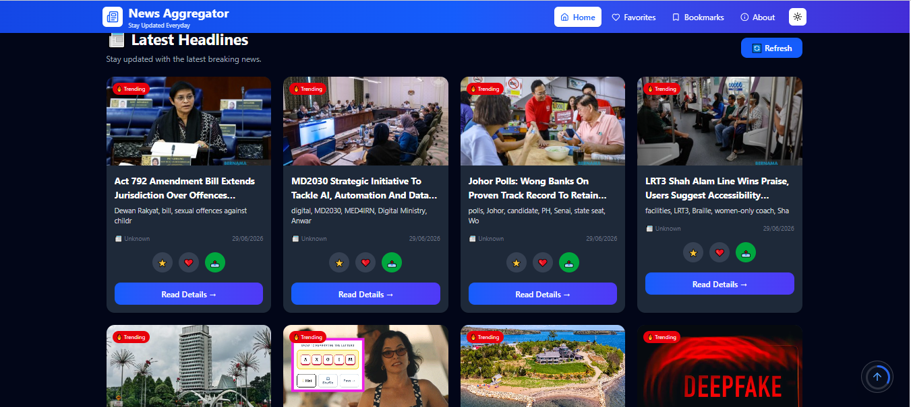
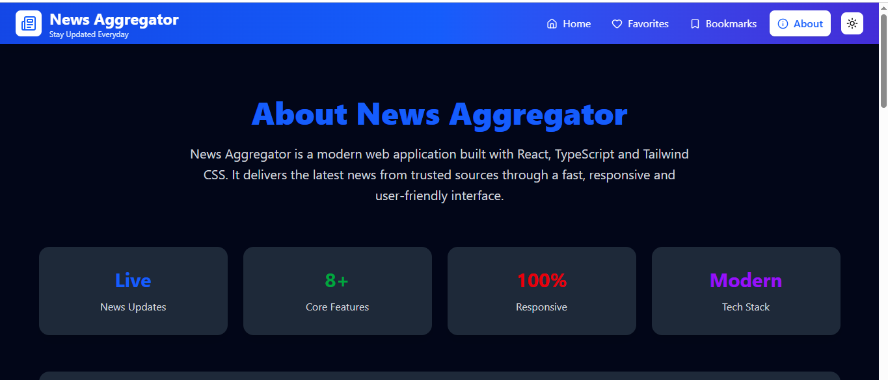
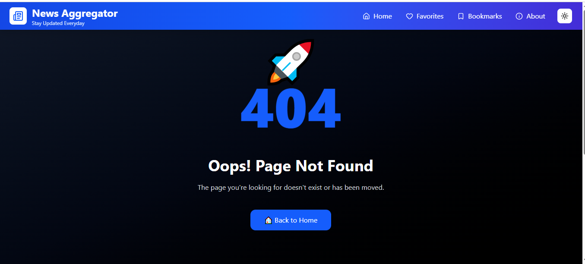

# 📰 News Aggregator

A modern and responsive **News Aggregator Web Application** built with **React, TypeScript, Tailwind CSS, and NewsData API**.

Stay updated with the latest breaking news from around the world through a clean, fast, and user-friendly interface.

---

## 🚀 Live Demo

> Coming Soon (Vercel Deployment)

---

## ✨ Features

* 📰 Live News from NewsData API
* 🔍 Search News
* 📂 Category Filtering
* ❤️ Favorite Articles
* ⭐ Bookmark Articles
* 📤 Share News
* 🌙 Dark / Light Mode
* 📱 Fully Responsive Design
* ⚡ Fast Loading
* 🎨 Modern UI with Tailwind CSS
* 🎞 Smooth Animations (Framer Motion)
* 🔄 Scroll To Top
* ❌ Error Handling
* 💀 Custom 404 Page
* ⏳ Skeleton Loading
* 📖 Detailed News Page

---

## 🛠 Tech Stack

| Technology       | Usage                 |
| ---------------- | --------------------- |
| React            | Frontend Library      |
| TypeScript       | Type Safety           |
| Vite             | Build Tool            |
| Tailwind CSS     | Styling               |
| React Router DOM | Routing               |
| Axios            | API Requests          |
| Framer Motion    | Animations            |
| React Hot Toast  | Notifications         |
| NewsData API     | Live News Data        |
| Local Storage    | Favorites & Bookmarks |

---

## 📦 Project Version

```text
Version : 1.0.0
Status  : Production Ready
```

## Project Structure

```text
news-aggregator/
│
├── public/
│   ├── favicon.svg
│   └── screenshots/
│
├── src/
│   ├── assets/
│   ├── components/
│   │   ├── common/
│   │   ├── layout/
│   │   └── news/
│   ├── context/
│   ├── hooks/
│   ├── pages/
│   ├── services/
│   ├── types/
│   ├── utils/
│   ├── App.tsx
│   └── main.tsx
│
├── package.json
├── tsconfig.json
├── vite.config.ts
└── README.md
```

## Getting Started

Clone the repository:

```bash
git clone https://github.com/your-username/news-aggregator.git
```

Go to the project directory:

```bash
cd news-aggregator
```

Install dependencies:

```bash
npm install
```

Start the development server:

```bash
npm run dev
```

Create a production build:

```bash
npm run build
```

Preview the production build:

```bash
npm run preview
```

## Environment Variables

Create a `.env` file in the project root.

```env
VITE_NEWSDATA_API_KEY=YOUR_API_KEY
```

You can get your API key from NewsData.io.

## Main Features

* Live news fetched from NewsData API
* Search news by keyword
* Category-based filtering
* Save favorite articles
* Bookmark articles
* Share news
* Responsive layout
* Dark mode support
* Animated UI
* Error handling
* Loading skeletons
* Scroll to top


## Screenshots

### Home


---

### Dark Mode



---

### Favorites


---

### Bookmarks


---

### News Details


---

### About



---

### 404 Page



---

## Future Improvements

The following features are planned for future releases:

* User Authentication
* Personalized News Feed
* AI-powered News Summarization
* Multi-language Support
* Push Notifications
* Offline Reading
* Reading History
* User Profile
* Advanced Search Filters
* Backend Integration

---

## Known Limitations

* Favorites and bookmarks are stored in Local Storage.
* News availability depends on the NewsData API.
* Some articles may not include an image.
* Free API plan has request limitations.

---

## Author

**Ankit Kumar Saini**

Full Stack Developer

Tech Stack:

* React
* TypeScript
* Tailwind CSS
* JavaScript
* Node.js

---

## License

This project is licensed under the MIT License.

See the `LICENSE` file for more information.
